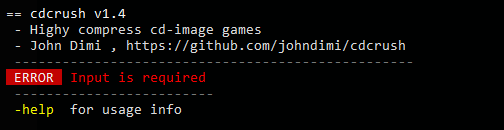

# CDCRUSH (node.js)

**Name**: CDCRUSH, *Highly compress cd-image games*  
**Author:** John Dimi :computer:, <johndimi@outlook (.) com> *twitter*: [@jondmt](https://twitter.com/jondmt)  
**Project Page and Sources:** [https://github.com/johndimi/cdcrush](https://github.com/johndimi/cdcrush)  
**Language:** HAXE compiled to Node.js, **License**: MIT  
**Version:** 1.5 **Platform:** Windows  
**Sister Project**: [cdcrush.net](https://github.com/johndimi/cdcrush.net)

## :mega: What is it

  

**Cdcrush** is a tool that can highly compress **CD based games**, *(PS1, PC-Engine, PC, etc.)*. Reduces size of data and audio tracks. Ideal for **storage/sharing**.  
Then it can **restore** a compressed archive back to a CD Image `.cue/.bin`. Also you can use a **lossless audio codec** to store/restore a `1:1` ,byte to byte, copy of a CD Image.

:hammer_and_wrench: **In Detail**:  
- Applies **ECM tools** to DATA tracks. This removes redundant data *(Error Correction/Detection Codes)* from the CD sectors. This data can then be reconstructed
- Encodes **CDDA** audio tracks with lossy or lossless codecs *(Vorbis, Opus, FLAC, TAK)*
- Puts everything into an archive *(7zip, FreeArc)*
- Then the process can be reversed and the original **.bin/.cue** file is reconstructed

  

### Use cases

- **BACKUP** a 1:1 copy of CD images for **cold storage**. If you choose to encode audio tracks with `FLAC` or `TAK`, then the restoration will be the same as the source down to the last byte. This method is **more efficient** than directly compressing a cd image with a data archiver (*like 7zip*)
- **Highly Compress** your personal collection of CD  games for storage. You can choose a lossy audio codec to greatly reduce the filesize of some games that feature many audio tracks. The audio will still sound great because modern audio codecs do a decent job at compressing audio.
- **Convert** CD images that include multiple audio tracks to **.cue/.bin + encoded audio tracks**, using an audio codec of your choosing. Some emulators *like mednafen* support loading these type of `.cue` files.

   

### :chart: Compression comparisons of some games:

| Name | Raw Size | 7-zip 0 | CDCRUSH Lossless 1| CDCRUSH Lossy 2|
|------|-----------|--------------------------|-----------------|-------------------|
| Wipeout XL| 680MB | 567MB | **407MB** | **72MB**|
| Tomb Raider | 505MB | 306MB | **275MB** | **169MB**|
| PO'ed | 139MB | 50MB | **39MB** | **18MB**|

**0**: Direct compression of the CD Image with 7zip. Profile : Maximum Compression  
**1**: Audio : TAK , Archive : FreeArc High   
**2**: Audio : Ogg Vorbis 64k , Archive : FreeArc High 

## :paperclip: General Info
- **cdcrush** is only compatible with `.cue/.bin` type CD images. Some programs that allow you to rip your CDs to this format are:
  - [cdrtfe](https://cdrtfe.sourceforge.io/cdrtfe/index_en.html), open source
  - [ImgBurn](http://imgburn.com), free but not open source.
- This is a **CLI** application. Some basic CLI knowledge is required. 
- There is also a [dotNet version of cdcrush](https://github.com/johndimi/cdcrush.net) it's simpler to use, but it doesn't support batch operations.
- When selecting **data compression**, FreeArc offers the best ratios *(the default)*

## :large_blue_diamond: Installing cdcrush

1. Get [nodeJS](https://nodejs.org/en/) *(version 10+)* and make sure **npm** is also installed *(NodeJs installer should install npm)*
2. On a terminal type : `npm install -g cdcrush`  
*This will install cdcrush globally and you can use it from anywhere.*
3. Cdcrush needs [ffmpeg](http://ffmpeg.org/) to be set on the user/system path. It is a free and open source program required to encode audio tracks.  
:warning: **FFmpeg NEEDS to be set on PATH** . The easiest way to do this is to copy `ffmpeg.exe` into your `c:\windows` folder. 
4. That's it. **cdcrush** is ready to go.

  
 Calling cdcrush alone doesn't do much, you need to define some arguments

## :vertical_traffic_light: Running, Program arguments

After installing **cdcrush** with npm, you can run it from anywhere in a terminal by typing  
**`cdcrush`**

The basic format of arguments is:  
**`cdcrush <input files> <action> <options> -o <output dir>`**

*You can run `cdcrush -help` for a quick help.*

### :file_folder: Input / Output

- **Input Files** ⇒ You can use `.cue` or `[.arc | .7z | .zip ]` files. Wildcards are supported. `*.cue, *.*`
- **Output Dir** ⇒ Set with `-o` followed by `output dir`  
  Setting an output directory is **optional**. If you skip it, it will automatically be set to the same folder as the **input file**.

*e.g.*  
  `cdcrush *.arc -o c:\games`  *To restore multiple files on same folder as input file*  
  `cdcrush game1.zip game2.arc -o c:\games`*To restore selected files into c:\games*

### :green_book: Actions
You can only set **one** action at a time :
- :arrows_clockwise: **Restore** ⇒ Set with **`r`**  
  Will restore an archive back to `cue/bin` files.

- :cd: **Crush** ⇒ Set with **`c`**  
  Will compress a `cue/bin` CD into a cdcrush archive. *(.arc,.7z,.zip)*

- :warning: You can **skip** setting an action and it will be auto guessed from the input file extension 
  

*e.g.*  
 `cdcrush r game.arc` ⇒ *will restore game.arc back to bin/cue*  
 `cdcrush game.7z` ⇒ *will also restore game.arc back to bin/cue. The action was guessed from the filename*  `cdcrush game.cue` ⇒ *will crush a game with the default parameters. Action was guessed from the filename*

### :orange_book: Options

You can set multiple options :

- **Audio Codec** ⇒ set with `-ac`, followed by `CODEC ID : QUALITY`  <works with crush>   
  :warning: Defaults to `FLAC`  
   Sets the Audio Codec / Quality for the audio tracks when crushing a cd.  
  Codec IDs:  `FLAC` , `OPUS`, `MP3`, `VORBIS`, `TAK`  
  Codec Quality : A number from `0` to `2` *( 0 = low quality, 1 = normal quality, 2 = high quality )*  *(Note FLAC and TAK ignore the quality, since they are lossless)*  
  *e.g.* `-ac OPUS` , `-ac VORBIS:0`, `-ac TAK` , `-ac MP3:2` *(Skipping a quality it defaults to `:1`)*
- **Data Compression** ⇒ set with `-dc` followed by `ARCHIVER ID : LEVEL` <works with crush>  
    :warning: Defaults to `ARC:1`  
    Sets the Archiver and Compression level to be used when crushing a cd.  
  Archiver IDs : `ARC` , `7Z`, `ZIP`  
  Level : A number from `0` to `2` *( 0 = low level, 1 = normal level, 2 = high level)*  *(0 is faster but produces bigger archivers, 2 is the slowest and produces smaller archives)*  
  *e.g.* `-dc ARC:2` , `-dc ZIP`, `-dc 7Z:2'`  *(Skipping a level it defaults to `:1`)*
- **No Subfolder** ⇒ set with `-nosub` *<Works with restore>*  
  By default restoring a cd will put it into a subfolder on the output path. Set this flag to skip creating a subfolder and create the files directly to the output folder.
- **Encoded Audio Files/Cue** ⇒ set with `-enc` *<Works with restore and crush>*  
  Produces a `.cue` with encoded audio tracks.  **Auto-creates subfolder** on the output dir.   
  :information_source: **Check the section below for more info **  
  e.g. `cdcrush game.cue -ac VORBIS:1 -enc` ⇒ Will encode all audio tracks and create new .cue/.bin/.audio files in a subdirectory.
- **Merge tracks** ⇒ set with `-merge`  *<Works with restore>*  
Will merge tracks and produce a **single** `.bin` file even if the source CD had multiple .bin files.
- **Save Infos** ⇒ set with `-nfo`  <Works with restore and crush>  
Produces a `.txt` file alongside the output file with some information on the operation, like filesize and track checksums.
- **Temp Folder** ⇒ set with `-tmp` followed by a valid writable `path`  
  :warning: *(Advanced Feature)*, Sets the temp folder for use in operations. It defaults to the OS `%TEMP%` folder. Useful if you want to use a ramdrive. Make sure it can hold up to 1.2GB of data.
- **Max Threads** ⇒ set with `-th` followed by a number `1-8`  
  :warning: *(Advanced Feature)*, Sets the maximum number of concurrent processes for encoding tracks. **Defaults to 2**. Don't set this bigger than the number of logical cores you have.

## :information_source: Note on Converting to .cue/encoded audio

You can **convert** a `.cue/.bin` CD, into another `.cue/.bin` combo with **encoded audio tracks**. This is really useful if you want to play a CD in an emulator that supports loading `.cue` files in this format (*e.g. mednafen supports libvorbis and FLAC audio*)

Just use the option `-enc` with the **crush** or **restore** action. *(For when using it with the restore action, the audio tracks will not be re-encoded, they will just be left as they were when originally encoded.)*

Example of what this operation does.

## :exclamation: CHANGELOG
See [`CHANGELOG.MD`](CHANGELOG.md)

## :clipboard: Q&A

**Q** : Why?  
 **A** : I wanted to save space on my hard drive and I think  it's a decent way to store CD images, better than just compressing with  7zip or Rar. Also It was a good programming practice.

**Q** : Does it support games from SegaCD, Jaguar, 3DO, X, Y?  
 **A** : Theoretically it should support all valid **.cue/.bin** files, try it out.

**Q** : I am worried about the audio quality.  
 **A** : Vorbis and Opus can produce very good results even at 96kbps. If you just want to keep the games for personal use it is fine. **However** if you don't want any compressed audio you can select the **FLAC** or **TAK** codecs, which are lossless.

**Q**: Is storing the entire CD with FLAC/TAK really lossless? I am worried about byte integrity.  
 **A**: YES, to the last byte. The filesize and checksums of  the restored tracks are the same as the original ones.  (data&audio).

## :stars: dotNET Version

Checkout the  [dotNet version](https://github.com/johndimi/cdcrush.net), it offers a GUI, so it simpler to use, but it doesn't support batch operations. *Windows Only*

## :triangular_flag_on_post: Finally

Feel free to provide feedback for this project   
donations are always welcome! [https://www.paypal.me/johndimi](https://www.paypal.me/johndimi)  
Thanks for checking this out,  
John.